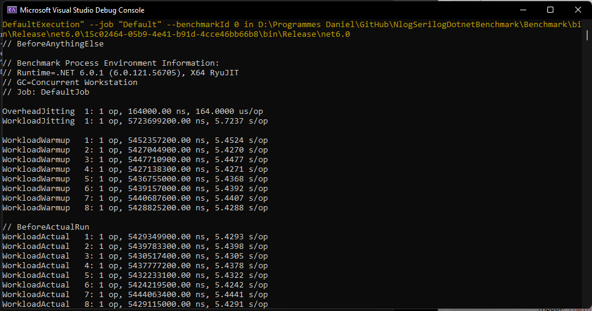

# Nlog vs Serilog with BenchmarkDotNet
This project benchmark Nlog and Serilog in a simple batch project.

My goal is to find the best option for my program and also to provide you with an example for your own performance testing
with Serilog/Nlog or others.

I use [BenchmarkDotNet](https://benchmarkdotnet.org/articles/overview.html).

<br>

## The tests
2 series of tests is used, sync and async. More later.
For a total of 4 tests.

| Method       | 
| :----------- | 
| Serilog_DefaultExecution | 
| Nlog_DefaultExecution    | 
| Nlog_Async               | 
| Serilog_Async            | 

<br>

#### Benchmark configuration

The Benchmark.csproj is the project where the benchmark tests is configure and run.

In the class BenchmarkCases.cs you can find the configuration of all tests.
Each run all log file are deleted with the Cleanup() method and all test is run by the attribute [Benchmark()].


```csharp
 [GlobalCleanup]
    public void Cleanup()
    {
        Directory.Delete(PATH, true);
    }

    [Benchmark(Baseline = true)]
    public void Nlog_DefaultExecution()
    {
        NlogProvider.Program.Main(new string[] { NB_EXECUTION, False, PATH });
    }

    [Benchmark()]
    public void Nlog_Async()
    {
        NlogProvider.Program.Main(new string[] { NB_EXECUTION, True, PATH });
    }

    [Benchmark()]
    public void Serilog_DefaultExecution()
    {
        SerilogProvider.Program.Main(new string[] { NB_EXECUTION, False, PATH });
    }

    [Benchmark()]
    public void Serilog_Async()
    {
        SerilogProvider.Program.Main(new string[] { NB_EXECUTION, True, PATH });
    }
```

<br>

#### How to run the benchmark

You need to run the Benchmark.csproj in **Release mode** and to start, go to **debug/Start without debugging** or **Ctrl+F5**.
A Console will start de benchmark. it will take a few minutes.




<br>
<br>


## Projects

#### Logger
Logger Is the batch exemple. It ILogger to write information log with [Microsoft.Extensions.Logging](https://docs.microsoft.com/en-us/dotnet/core/extensions/logging?tabs=command-line)

```csharp
    using (_logger.BeginScope("DoSomethingElse"))
    {
        for (int i = 0; i < nbExecution; i++)
        {
            using (_logger.BeginScope("loop : {i}", i))
            {
                _logger.LogInformation("Begin loop : {i}", i);

                Thread.Sleep(100);

                _logger.LogInformation("End loop : {i}", i);
            }
        }

        _logger.LogInformation("End DoSomethingElse");
    }
```


#### NlogProvider
This project uses [NLog](https://nlog-project.org) provider to log into a file the log of Logger project.

```csharp
 .ConfigureLogging((context, logging) =>
    {
        logging.ClearProviders();
        logging.SetMinimumLevel(Microsoft.Extensions.Logging.LogLevel.Debug);
        SetupLogger(Path.Combine(path, "Nlog.log"));
    })
    .UseNLog();
```


#### SerilogProvider
This project uses [Serilog](https://serilog.net/) provider to log into a file the log of Logger project.

```csharp
host.UseSerilog((context, logger) =>
{
    logger.Enrich.FromLogContext();
    logger.WriteTo.File(fileName,
        outputTemplate: GetOutputTemplate()
        );
});
```

<br>
<br>

## The result


#### My pc setup

| Infos                          |                                                                                            |
|:-------------------------------|:-------------------------------------------------------------------------------------------|
| Nom du système d’exploitation: | Microsoft Windows 11 Professionnel                                                         |
| Processeur:                    | Intel(R) Core(TM) i7-8700K CPU @ 3.70GHz, 3696 MHz, 6 cœur(s), 12 processeur(s) logique(s) |
| Mémoire physique totale:       | 32 701 Mo                                                                                  |
| Description de la carte:       | NVIDIA GeForce GTX 1080 Ti                                                                 |


<br>

Result Folder : NlogSerilogDotnetBenchmark\Benchmark\bin\Release\net6.0\BenchmarkDotNet.Artifacts\results

|                   Method |    Mean |    Error |   StdDev |     Min |     Max | Ratio | Rank | Allocated |
|-------------------------:|--------:|---------:|---------:|--------:|--------:|------:|-----:|----------:|
|            Serilog_Async | 5.431 s | 0.0086 s | 0.0081 s | 5.416 s | 5.447 s |  1.00 |    1 |         - |
| Serilog_DefaultExecution | 5.433 s | 0.0067 s | 0.0063 s | 5.424 s | 5.442 s |  1.00 |    1 | 348,416 B |
|    Nlog_DefaultExecution | 5.433 s | 0.0055 s | 0.0052 s | 5.424 s | 5.444 s |  1.00 |    1 | 881,040 B |
|               Nlog_Async | 5.434 s | 0.0113 s | 0.0106 s | 5.415 s | 5.454 s |  1.00 |    1 | 898,904 B |


<br>

## Conclusion

The result are very similar between scenario cases. Nlog or Serilog seems to have the same performance in terms of execution time, 
however we can see that Serilog takes less memory than Nlog. 

Maybe my test case is too simple? I'll let you add your own tests, maybe you will find which one works best for you.


<br>
<br>